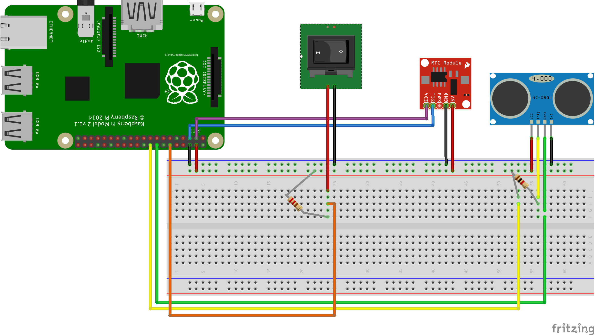

# Purchase College Storm Water Measurement

Built for an ongoing collaborative project between the Natural Sciences and New Media departments at Purchase College, I am developing a system for the collection of data about storm water runoff from our W1 and W2 parking lots.

_should a sensor break there are detailed setup instructions below_.

## Equipment Used
1. Raspberry Pi 2 
2. Hc-sr04 digital utrasonic range sensor
3. Ds1307 real time clock module
4. Raspberry Pi Camera

## Dependancies
* [Picam](https://github.com/ashtons/picam)(follow link for setup instructions)
* [Real time clock setup](https://learn.adafruit.com/adding-a-real-time-clock-to-raspberry-pi/overview)
* Hcsr04 wiring diagrams coming soon
* libraries
`apt-get install python-dev`
`apt-get install pyton-RPi.GPIO`

## Setup

### Flash image onto sd card
* Connect sd card to your computer
* Use Disk Utility to erase the contents of the SD Card
* In Terminal
  * `diskutil list` Locate your SD Card. Write down the identifier of your SD Card exe: disk2
  * `diskutil unmountDisk /dev/disk2` Unmount the SD Card
  * `sudo newfs_msdos -F 16 /dev/disk2` Reformat the SD Card as FAT16
  * `sudo dd if=~/Desktop/pcswm/pcswm.img of=/dev/disk2` Assuming the image is in a folder called pcswm on your desktop and your SD card is located at /dev/disk2 this will write the image to the sd Card. _Make sure the the location of the image and the SD Card are correct before running this command_. This can take a very long time. you will see a blinking cursor while this is running. you will be shown a new command prompt when the process is completed.

### Set up Real Time Clock
* Build the circuit detailed [here](https://learn.adafruit.com/adding-a-real-time-clock-to-raspberry-pi/wiring-the-rtc)
  * `sudo i2cdetect -y 1` This checks that the RTC is working. If there is a UU in position 68 continue to the next step. Otherwise follow [this setup tutorial from Adafruit](https://learn.adafruit.com/adding-a-real-time-clock-to-raspberry-pi/overview)
* Make sure the Raspberry Pi is connected to the internet and set the time from the command line:
  * `sudo raspi-config` then selecting _Internationalisation Options_ and setting the time.
* `sudo hwclock -w` This writes correctly set time to the RTC.
* `sudo hwclock -r` Print time from RTC to check that everything has worked.

## Wiring Diagram

### SCR04 Ultrasonic rangefinder pins
* _Trig_ to _GPIO23_
* _Echo_ to _GPIO24_
* _VCC_ to _5v_
* _GND_ to _GND_

### Sparkfun DS1307 RTC Module
* _SDA_ to _SDA_
* _SCL_ to _SCL_
* _VCC_ to _5v_
* _GND_ to _GND_

